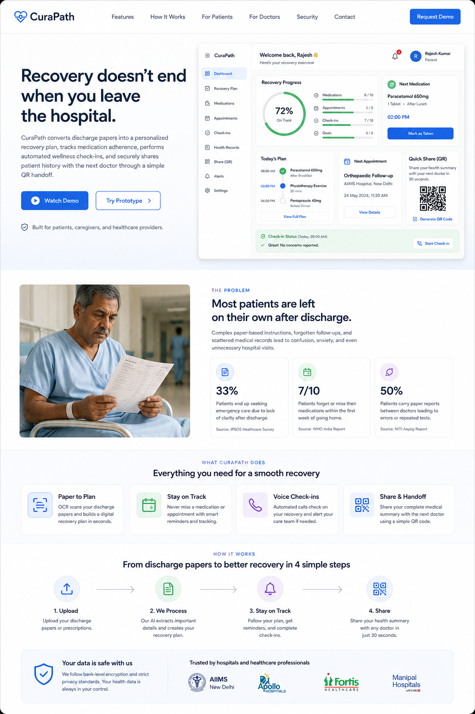
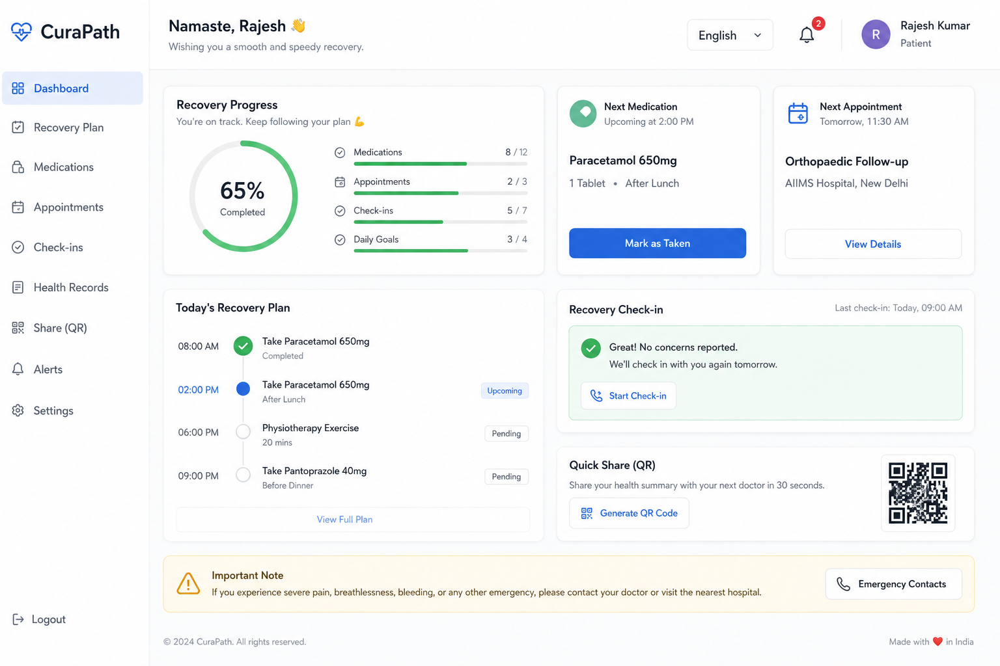
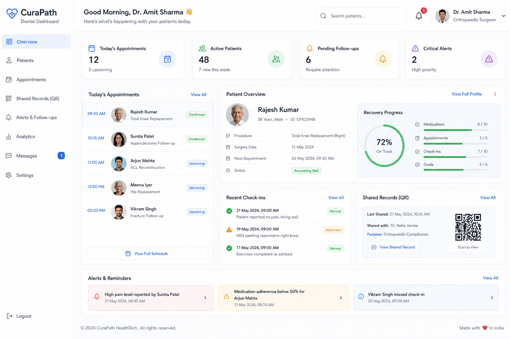
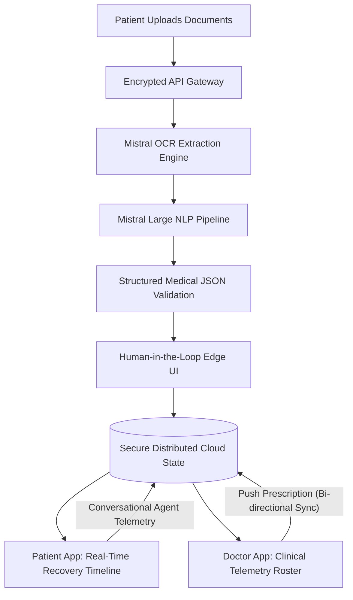

# CuraPath: Autonomous Recovery Intelligence System

CuraPath is a production-grade, enterprise healthcare platform engineered to transform fragmented hospital discharge protocols into an active, autonomous recovery engine. Designed to be the definitive solution for the Alan Precision Track: Agentic Health Protocols.

---

## The Ultimate Post-Discharge Architecture



Globally, hospitals face a massive gap in care continuity: patients are discharged with complex paper instructions, resulting in critical medication errors and preventable readmissions. CuraPath eradicates this gap by deploying an autonomous agentic framework that actively manages, monitors, and syncs a patient's recovery trajectory in real-time.

### Intelligent Patient Command Center


### Specialist Provider Analytics Hub


---

## Enterprise System Architecture

The following diagram illustrates our highly scalable, distributed cloud architecture and Mistral-powered AI pipeline:



---

## Core Capabilities

| Module | Description | Implementation Architecture |
|--------|-------------|-----------------------------|
| Zero-Friction Agentic Intake | Instantaneous file ingestion and intelligence extraction for unstructured hospital discharge summaries. | Multi-modal OCR pipeline paired with Mistral Large for semantic medical parsing. |
| Autonomous Care Roadmap | Converts static data into an actionable, real-time chronological recovery timeline. | Dynamic state engine generating predictive alerts and medication tracking. |
| Agentic Voice Telemetry | Automated conversational check-in protocols monitoring patient physiological status and reporting anomalies. | LLM-driven voice logic logging simulated telemetry directly to the provider dashboard. |
| 30-Second Specialist Handoff | Generates a dynamic, encrypted QR code encapsulating the patient's verified history for instant specialist onboarding. | Secure data serialization mapped to scannable clinical passports. |

---

## Technology Stack

| Domain | Enterprise Technology |
|--------|-----------------------|
| Frontend Architecture | React 18, Vite, TypeScript |
| UI/UX Engineering | Tailwind CSS, Lucide-React, CSS Grid/Flexbox |
| State Synchronization | Distributed Real-Time State Layer |
| AI Pipeline | Mistral LLM API, Mistral OCR Engine |
| Routing Engine | React Router DOM v6 |
| Deployment & Scale | Cloud-Native Build Configuration |

---

## Setup & Deployment Instructions

Follow these instructions to configure and execute the CuraPath environment locally:

1. Clone the repository and initialize the workspace:
   ```bash
   git clone <repository-url>
   cd curapath/web
   ```

2. Install core dependencies and security patches:
   ```bash
   npm install
   ```

3. Launch the local development cluster:
   ```bash
   npm run dev
   ```

4. Access the application interface:
   Open a modern web browser and navigate to `http://localhost:5173`.

---

## Walkthrough: Evaluating the Platform

To fully experience the power and seamless integration of the CuraPath ecosystem, follow this clinical simulation:

1. System Initialization:
   Navigate to the root route `/` to view the primary platform overview. Click "Try Prototype" to initiate the secure environment.

2. AI Intake Protocol:
   Navigate to the `/upload` route. Drag and drop a sample discharge summary. Proceed through the proprietary human-in-the-loop verification screen to generate the baseline intelligence model.

3. Autonomous Patient Engine:
   Navigate to `/dashboard`. Interact with the generated recovery timeline. Mark medications as administered and trigger the conversational check-in sequence to generate physiological telemetry.

4. Bi-Directional Provider Sync:
   Open a secondary browser tab and navigate to `/doctor`. View the live patient roster. Select the active patient and utilize the "Add Rx" module to prescribe a new medication. Switch back to the Patient Dashboard tab to observe the new prescription successfully synced in real-time across the platform architecture.
